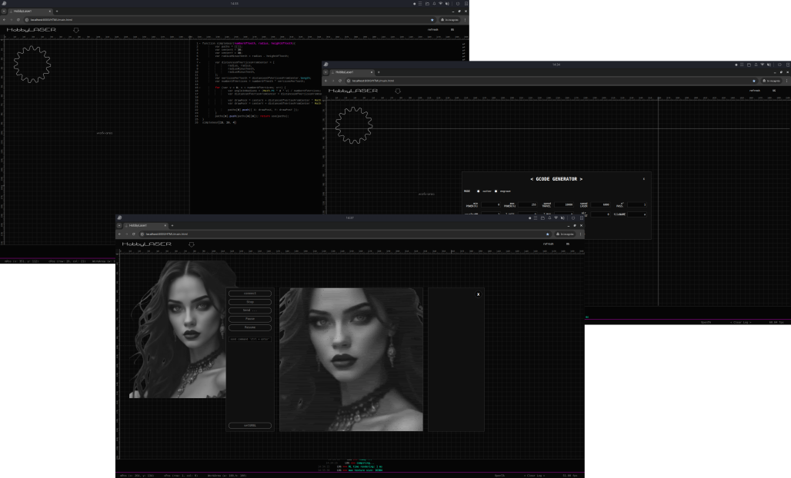

# HobbyLaser (PWA)

> [ English](README.md) | [ Italiano](README.it.md)


[](https://marco-f.github.io/HobbyLASER/)


---

A **Progressive Web App (PWA)** for controlling **CNC or laser machines** from the browser using the **Web Serial API**. 
It allows users to draw, process images, generate G-code, and communicate with controllers – directly in Google Chrome, with full offline support.

HobbyLASER is aimed at users of CNC machines, engravers, and plotters—particularly self-built or budget models. It was developed to fill the gap between the basic software offered by low-cost machine manufacturers and professional software solutions, with a focus on hobby use and rapid prototyping.

It should be considered a constant work in progress, but thanks to its nature as a Progressive Web App (PWA), updates are available immediately upon release.
Currently, it can import text-based files with the following extensions: .svg, .dxf, .gcode, .nc, and raster images in .png, .jpg, or .jpeg format. The .svg format is an open standard, but only single-path drawings using absolute commands are accepted. For example, a file exported from Inkscape will be rejected if it contains multiple paths, groups, or uses relative commands.
                                                     
                           
> ⚠ **Optimized for Google Chrome in Dark Mode**

---

<p align="center">
    
</p>

<h2 align="center">Disclaimer</h2>
<h3 align="center" color="red">**A CNC OR A LASER ARE NOT TOYS!** </h3>
<h4 align="center"> Using a CNC or laser without proper training and protection can cause serious injury and blindness. We do not accept any liability for damages resulting from the use of this software.</h4>
<h4 align="center"> 🔗 [Read more about laser safety](https://www.lasersafetyfacts.com/laserclasses.html) </h4>  
<h4 align="center"> **ALWAYS WEAR SAFETY GLASSES!** </h4>

---

### Live Demo

Try it now: [https://marco-f.github.io/HL/](https://marco-f.github.io/HL/)

---

### Screenshots

<p align="center">
  
</p>

---

## Table of Contents

* [Features](#features)
* [SVG, G-code & Image Manipulation](#svg-g-code--image-manipulation)
* [Web Serial API](#web-serial-api)
* [How to Run Locally](#how-to-run-locally)
* [Contributing](#contributing)
* [Technologies Used](#technologies-used)
* [Changelog](#changelog)
* [Acknowledgments](#acknowledgments)
* [Documentation](#documentation)

---

### Features

* **Interactive Drawing** – Create vector designs directly in the browser. Supports polyline, primitives, boolean and transformation operations.
* **Import/Export** – Support for SVG and DXF files.
* **Advanced Text Paths** – Generate text paths with proper handling of letter holes and micro-junctions.
* **Image Manipulation** – Resize, rotate, translate, adjust gamma, dithering, halftone, crop, and convert to vector.
* **Customizable G-code Generation** – Set laser power, speed, passes, air assist, and more.
* **3D Preview & Simulation** – Real-time visualization of cutting paths.
* **File & Cache Management** – Save G-code files locally with IndexedDB.
* **GRBL Control** – Connect, send commands, stop, pause, resume, read status, handle errors, and estimate job time.
* **Offline & PWA** – Work offline and install the app like a native app.
* **Dark Mode Ready** – Optimized for low-light environments.

---

### SVG, G-code & Image Manipulation

1. **SVG & Vectors**

   * Create and edit polylines, rectangles, circles, and other primitives.
   * Boolean operations (union, difference, intersection).
   * Geometric transformations: scale, rotate, translate, mirror, offset.

2. **Text**

   * Convert text to vector paths.
   * Manage internal letter holes (e.g., "o", "a", "e").

3. **Images**

   * Transform: resize, rotate, translate.
   * Process: dithering, halftone, crop, vector conversion.

4. **G-code**

   * Custom parameters: power, speed, passes, air assist ...
   * Creation of micro joints, pattern fillings.
   * Real-time 3D preview and simulation.
   * File saving in local cache (IndexedDB).

5. **GRBL Control**

   * Connection and command sending via Web Serial API.
   * Stop, pause, resume functionality.
   * Monitor machine status, error handling, and time estimation.

---

### Web Serial API

This app uses the **Chrome Web Serial API** to communicate with CNC/laser controllers via serial connection.

* Access to serial ports from the browser
* Configure baud rate, data bits, parity, stop bits
* Asynchronous read/write via Streams API
* Detects connect/disconnect events
* Requires **user permission**
* Works in **Chromium-based browsers only**

---

## How to Run Locally

1. Clone the repository:

   ```bash
   git clone https://github.com/marco-f/HLgit
   ```
2. Navigate to the project folder:

   ```bash
   cd HL
   ```
3. Run a local web server (e.g., with http-server):

   ```bash
   npm install -g http-server
   http-server
   ```
4. Open your browser:

   ```
   http://localhost:8080
   ```
5. (Optional) Install the app as a PWA via the browser install prompt.

---

## Technologies Used

* **HTML/CSS/JS** – Core structure, layout, and logic
* **Service Workers** – Enable offline functionality
* **Web Manifest** – Metadata for PWA installation
* **Streams API** – For async serial communication
* **SVG & Canvas APIs** – Drawing and image rendering

---

## Contributing

1. Fork the repository
2. Create a new branch: `git checkout -b feature-name`
3. Commit your changes: `git commit -am 'Add feature'`
4. Push your branch: `git push origin feature-name`
5. Open a Pull Request

See the full [Contributing Guide](CONTRIBUTING.md)

---

## Changelog

**v1.0.0**

* First stable release with support for:

  * Serial connection via Web Serial API
  * Offline support with Service Workers
  * G-code generation from drawings and raster images

---

### Security and Privacy

* No personal data is collected.
* All operations run locally in the browser.
* Serial connection requires explicit user consent.

---

### License

This project is licensed under the [GNU GPL v3.0](https://www.gnu.org/licenses/gpl-3.0.en.html) – see the `LICENSE` file for details.

---

### Author

**Marco-F** – Lead Developer
[GitHub](https://github.com/marco-f)

---

### Acknowledgments

Thanks to the open-source community, browser engineers, and CNC enthusiasts.

---

### Credits

* [clipper.js](https://github.com/junmer/clipper-lib) – Polygon clipping and offsetting
* [opentype.js](https://github.com/opentypejs/opentype.js) – Font parsing and rendering
* [fabric.js](http://fabricjs.com/) – Canvas library
* [three.js](https://threejs.org/) – 3D rendering engine
* [Ace Editor](https://ace.c9.io/) – Embedded code editor
* [potrace.js](https://github.com/kilobtye/potrace) – Bitmap tracing

---

### Documentation

Incomplete and under active reorganization. [Wiki](https://github.com/marco-f/HobbyLASER/wiki/).
