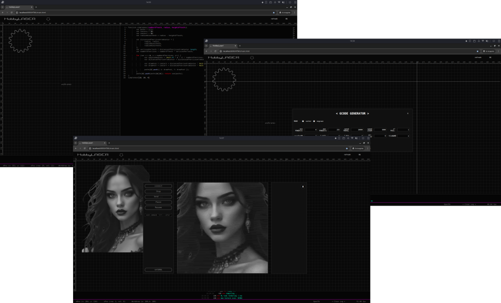

 
# HobbyLaser (PWA)

> 🇬🇧 [English](README.md) | 🇮🇹 [Italiano](README.it.md)


[](https://marco-f.github.io/HobbyLASER/)


---

## Overview

**HobbyLASER** is a **Progressive Web App (PWA)** designed to control **CNC machines and laser engravers** directly from the browser using the **Web Serial API**.

The application allows users to:

- draw vector graphics
- manipulate images
- generate G-code
- communicate with machine controllers

—all directly inside **Google Chrome**, with **full offline support**.

HobbyLASER targets hobbyists, makers, and users of **self-built or low-cost CNC/laser machines**, providing an intermediate solution between the minimal software shipped with budget hardware and expensive professional CAM tools.

The software is designed to be **simple but powerful**, combining graphical tools with script-based processing to generate optimized machine instructions.

Since it runs entirely in the browser, **no installation, drivers, or dependencies are required**.

Being a **Progressive Web App**, updates are automatically available as soon as they are released.

---

## Supported File Formats

**Vector**
- .svg
- .dxf

**G-code**
- .gcode
- .nc

**Raster Images**
- .png
- .jpg
- .jpeg

### SVG Notes

SVG is an open standard, but **only absolute commands are supported**.

When exporting from software like **Inkscape**, make sure to:

- convert objects to **paths**
- use **absolute commands**
- set document units to **millimeters**
- adjust the **document size** to match the workspace

---

## Disclaimer

### ⚠ A CNC OR A LASER ARE NOT TOYS

Using CNC machines or lasers without proper training and protection can cause **serious injuries or blindness**.

The authors **accept no liability** for damage or injury caused by the use of this software.

More information:  
https://www.lasersafetyfacts.com/laserclasses.html

**ALWAYS WEAR PROTECTIVE LASER SAFETY GLASSES.**

---

## Live Demo

https://marco-f.github.io/HL/

---

## Screenshots



---

# Features

## Interactive Drawing

Create vector graphics directly in the browser.

Supported tools include:

- polylines
- rectangles
- circles
- geometric primitives
- boolean operations
- transformation tools

Transformations include:

- scale
- rotate
- translate
- mirror
- offset
- and other
---

## Precision Dimensioning

A **high-accuracy dimensioning tool** allows precise measurement and annotation of designs.

Features include:

- linear measurements
- reference dimensions
- real-time updates while editing geometry
- millimeter-based precision for fabrication workflows

---

## Nesting Optimization

A **material nesting tool** automatically arranges parts to **minimize waste and optimize cutting paths**.

Capabilities include:

- automatic part layout
- material usage optimization
- rotation of parts for better packing
- preparation for batch cutting

---

## Advanced Text Paths

Text can be converted to **vector paths**, enabling engraving and cutting.

Features include:

- correct handling of **internal holes** in letters (e.g., A, O, P, B)
- automatic generation of **micro-junctions**
- compatibility with multiple fonts

---

## Image Processing

Raster images can be processed and converted for laser engraving.

Supported operations:

- resize
- rotate
- translate
- crop
- gamma correction
- dithering
- halftone generation
- raster-to-vector conversion

---

## G-code Generation

Customizable G-code generation allows full control over machine parameters.

Supported options:

- laser power
- cutting speed
- multiple passes
- air assist control
- pattern filling
- micro-joints for cut stability

Includes a **real-time 3D preview and toolpath simulation** before sending commands to the machine.

---

## Integrated Code Editor

The built-in **Ace Editor** provides direct editing of generated G-code.

Enhanced usability features include:

- contextual tooltips
- quick access to drawing tools
- transformation commands
- geometry modification
- direct conversion to G-code

---

## GRBL Machine Control

Direct communication with GRBL-based controllers via the **Web Serial API**.

Capabilities include:

- connect to serial devices
- send commands
- start, pause, resume, stop jobs
- read machine status
- error handling
- job time estimation

---

## File and Cache Management

Generated files and working data can be stored locally using **IndexedDB**.

Advantages:

- fast loading
- persistent local storage
- offline access to recent jobs

---

## Progressive Web App

HobbyLASER can be installed like a native application.

Features:

- offline operation
- automatic updates
- local caching via Service Workers
- installable on desktop and mobile devices

---

## Dark Mode

The interface is optimized for **Google Chrome Dark Mode**, making it suitable for workshop environments with low lighting.

---

# Running Locally

Clone the repository:

```bash
git clone https://github.com/marco-f/HL
```

Enter the project directory:

```bash
cd HL
```

Run a local web server:

```bash
npm install -g http-server
http-server
```

Open in your browser:

http://localhost:8080

---

# License

Licensed under **GNU GPL v3.0**  
https://www.gnu.org/licenses/gpl-3.0.en.html

---

# Author

**Marco-F**  
https://github.com/marco-f
